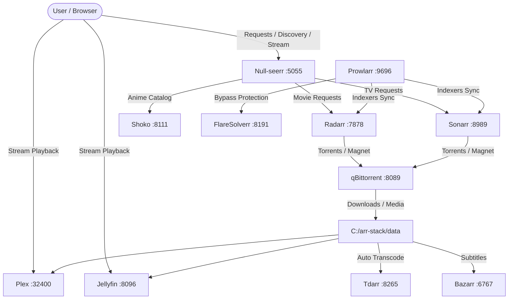

# 🚀 Null-seerr All-In-One Media Stack: Setup & Wiring Guide

An automated, self-hosted media ecosystem powered by **Null-seerr**, connecting indexers, download clients, metadata automation, transcoders, and media playback servers via unified CLI tooling.

---

## 🏛 Architecture Overview



---

## ⚡ 1-Click Interactive Setup Wizard

The fastest way to install and configure everything from scratch:

1. **Run Setup**: Double-click [`setup.bat`](file:///setup.bat) (or run `powershell -File scripts/install.ps1`).
2. The setup wizard automatically:
   - Verifies Docker Desktop and Python 3.
   - Configures your `.env` and directory paths.
   - Starts all containers via Docker Compose.
   - **Bypasses the `/setup` onboarding wizard** and provisions the local admin account.
   - Auto-wires Prowlarr, Radarr, Sonarr, and qBittorrent.
   - Auto-seeds public indexers (**YTS**, **Nyaa.si**, **The Pirate Bay**, **AnimeTosho**, etc.).
   - Applies standard Plex / Jellyfin naming formats.
   - Runs the Box Office autopilot hit sync.
   - Opens the Null-seerr web UI in your default browser.

---

## 🔑 Dynamic Stack Credentials

During installation, a secure, temporary 16-character password is automatically generated for the unified `admin` user across the stack and displayed in the terminal output:

| Service | Username / Account | Password | Note |
| :--- | :--- | :--- | :--- |
| **Null-seerr** | `admin` *(or `admin@nullseerr.local`)* | *Generated Temp Password* | Full Admin Privileges |
| **qBittorrent** | `admin` | *Generated Temp Password* | WebUI Access |
| **Plex** | *Plex Account* | *Plex Password* | Claim via Plex Web |
| **Jellyfin** | *Initial Wizard* | *Custom* | First-run local admin |

> [!TIP]
> Your active stack credentials are saved securely in [`C:\arr-stack\CREDENTIALS.txt`](file:///C:/arr-stack/CREDENTIALS.txt).

---

## ⚙️ Environment Configuration (`.env`)

All paths, ports, and credentials are customizable via `.env`:

```env
# Base Directories
ARR_ROOT=C:/arr-stack
CONFIG_ROOT=C:/arr-stack/config
DATA_ROOT=C:/arr-stack/data

# Media Sub-Directories
MEDIA_ROOT=C:/arr-stack/data/media
MOVIES_DIR=C:/arr-stack/data/media/movies
TV_DIR=C:/arr-stack/data/media/tv
ANIME_DIR=C:/arr-stack/data/media/anime
TORRENTS_DIR=C:/arr-stack/data/torrents
TRANSCODE_CACHE=C:/arr-stack/data/transcode_cache

# Ports
NULL_SEERR_PORT=5055
RADARR_PORT=7878
SONARR_PORT=8989
PROWLARR_PORT=9696
QBIT_WEBUI_PORT=8089
PLEX_PORT=32400
JELLYFIN_PORT=8096
BAZARR_PORT=6767
SUGGESTARR_PORT=4455
SHOKO_PORT=8111
TDARR_WEB_PORT=8265
```

---

## 💻 Manual CLI Setup Commands

If you prefer running individual commands from terminal:

### Step 1: Launch Containers
```powershell
cd C:\arr-stack
docker compose up -d
```

### Step 2: Run Stack Auto-Wiring & Indexer Seeder
```powershell
cd C:\arr-stack
python wire_stack.py
```

### Step 3: Run Boxarr Box-Office Autopilot
```powershell
cd C:\arr-stack
python boxarr.py
```

---

## 🌐 Service Directory & Port Reference

| Service | Local URL | Container Port | Purpose | Default Credentials / Note |
| :--- | :--- | :--- | :--- | :--- |
| **Null-seerr** | [http://localhost:5055](http://localhost:5055) | `5055` | Unified Portal, Requests, Stream | `admin` / `admin1234` |
| **Radarr** | [http://localhost:7878](http://localhost:7878) | `7878` | Movie Management | API in `config/radarr/config.xml` |
| **Sonarr** | [http://localhost:8989](http://localhost:8989) | `8989` | TV Series Management | API in `config/sonarr/config.xml` |
| **Prowlarr** | [http://localhost:9696](http://localhost:9696) | `9696` | Indexer Sync & Torrent Aggregation | API in `config/prowlarr/config.xml` |
| **qBittorrent** | [http://localhost:8089](http://localhost:8089) | `8080` | Download Client | `admin` / `admin1234` |
| **FlareSolverr**| [http://localhost:8191](http://localhost:8191) | `8191` | Cloudflare Solver Proxy | API Proxy |
| **Plex** | [http://localhost:32400/web](http://localhost:32400/web) | `32400` | Media Streaming Server | Plex Account |
| **Jellyfin** | [http://localhost:8096](http://localhost:8096) | `8096` | Open Source Media Server | Local admin |
| **Bazarr** | [http://localhost:6767](http://localhost:6767) | `6767` | Subtitle Automation | Links to Radarr/Sonarr |
| **Suggestarr** | [http://localhost:4455](http://localhost:4455) | `5000` | AI Movie & TV Recommendations | Discovers recommendations |
| **Shoko** | [http://localhost:8111](http://localhost:8111) | `8111` | Dedicated Anime Catalog | Anime DB Scanner |
| **Tdarr** | [http://localhost:8265](http://localhost:8265) | `8265` | Video Transcoder & Optimizer | Transcode Cache |

---

## 🎬 Pre-Configured Plex & Jellyfin Naming Formats

When running `wire_stack.py`, the following media formats are automatically configured:
- **Radarr (Movies)**:
  `{Movie CleanTitle} ({Release Year})/{Movie CleanTitle} ({Release Year}) [{Quality Full}]`
- **Sonarr (Standard TV)**:
  `{Series CleanTitle} - S{season:00}E{episode:00} - {Episode CleanTitle} [{Quality Full}]`
- **Sonarr (Daily TV)**:
  `{Series CleanTitle} - {Air-Date} - {Episode CleanTitle} [{Quality Full}]`
- **Sonarr (Anime)**:
  `{Series CleanTitle} - S{season:00}E{episode:00} - {absolute:000} - {Episode CleanTitle} [{Quality Full}]`

---

## 🔧 Helper Batch Scripts

- [`setup.bat`](file:///C:/arr-stack/setup.bat) - Interactive 1-click installer and setup wizard.
- [`start-stack.bat`](file:///C:/arr-stack/start-stack.bat) - Starts all Docker containers.
- [`wire-stack.bat`](file:///C:/arr-stack/wire-stack.bat) - Runs auto-wiring, indexer seeding, and naming config.
- [`run-boxarr.bat`](file:///C:/arr-stack/run-boxarr.bat) - Runs the Box Office autopilot sync.
- [`stop-stack.bat`](file:///C:/arr-stack/stop-stack.bat) - Stops all containers cleanly.
